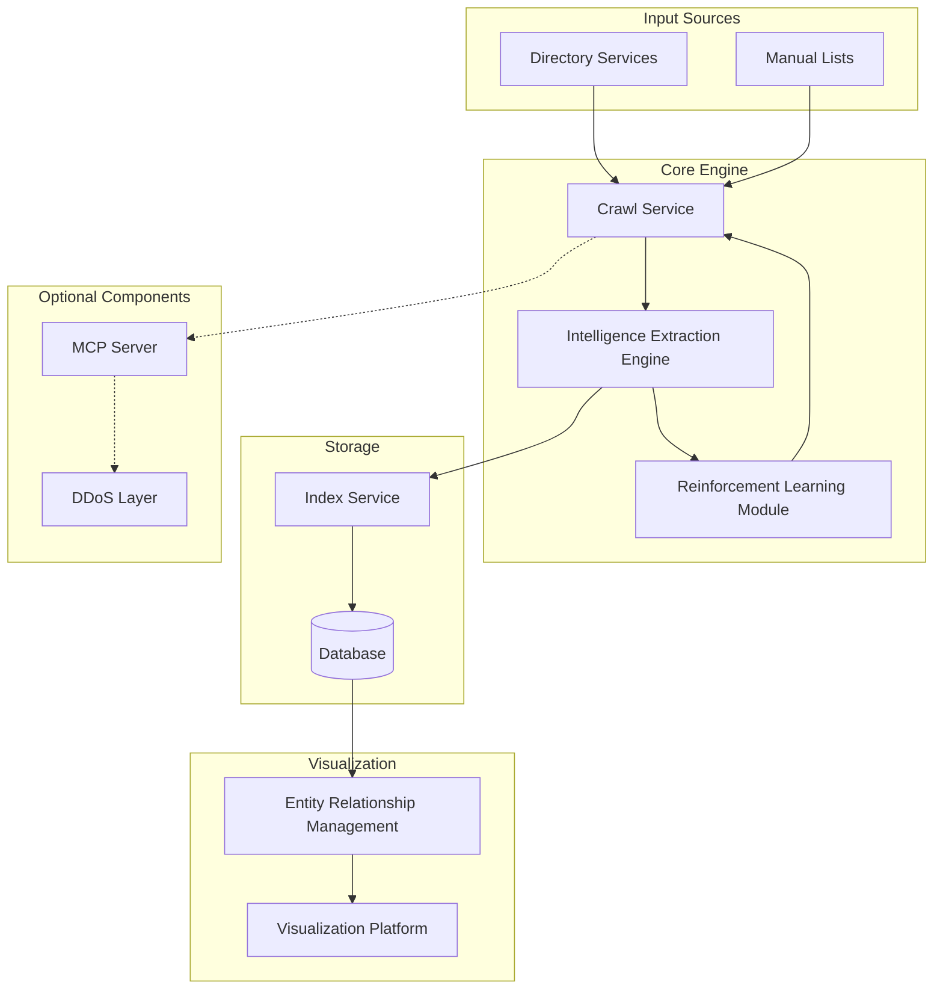

# **White Paper: PoopakV2 - OSINT System for Hidden Services**

## **Abstract**

This white paper introduces a detailed architecture for PoopakV2 decentralized Open Source Intelligence (OSINT) system tailored for monitoring, indexing, and analyzing hidden services over **Tor** and similar anonymity networks. The proposed system leverages multi-threaded and multi-protocol crawling mechanisms, advanced data extraction techniques using machine learning and natural language processing, and complex entity relationship mapping facilitated by graph databases. Emphasis is placed on maintaining robust security measures, including anonymity preservation through Tor circuit management and countermeasures against honeypot detection, while ensuring the system's scalability through distributed computing techniques and efficient resource utilization strategies.

## **Introduction**

The proliferation of hidden services within anonymity networks like Tor has significantly impacted modern intelligence gathering, requiring specialized OSINT tools capable of effectively navigating decentralized and often volatile environments. Traditional web crawling and data extraction methodologies face challenges such as network latency, unreliable service availability, and sophisticated anti-crawling measures employed by hidden services.

This paper builds upon established OSINT principles and introduces a system designed to address these challenges. By integrating advanced technologies such as reinforcement learning for adaptive crawling strategies and leveraging distributed architectures, the system aims to enhance the efficiency and effectiveness of intelligence gathering from hidden services.

## **System Architecture Overview**

The system architecture is composed of interconnected modules, each responsible for specific functionalities within the OSINT data collection and analysis pipeline. The primary components include:

- **Input Sources**: Diverse entry points such as directory services, manual lists, and user submissions that provide initial endpoints for crawling.
- **Crawl Service**: A robust, multi-threaded crawling engine capable of navigating hidden services with configurable depth and frequency settings, employing Tor circuits for anonymity.
- **Intelligence Extraction Engine**: Utilizes Natural Language Processing (NLP), machine learning models, and pattern recognition algorithms to extract valuable intelligence from unstructured data.
- **Index Service**: Manages indexing of crawled data using scalable databases and search engines, facilitating efficient querying and retrieval.
- **Entity Relationship Management**: Employs graph databases to map and visualize complex relationships between entities, services, and content within the hidden service ecosystem.
- **Reinforcement Learning Module**: An adaptive learning system that optimizes crawling strategies based on feedback from the extraction and analysis processes.
- **MCP Server Integration**: An optional module designed to interact with DDoS protection layers, employing techniques to bypass common anti-crawling measures.

The modular design allows each component to be developed and scaled independently, facilitating robust performance and adaptability to evolving hidden service environments.

## **Core Components**

### **1. Crawl Service**

The **Crawl Service** is the backbone of the system, responsible for systematically navigating hidden services to collect data for analysis. Key technical specifications include:

- **Multi-Threaded Architecture**:
  - Implements asynchronous I/O and event-driven programming using frameworks like **Twisted** or **Asyncio**.
  - Handles multiple crawl tasks concurrently to manage the high latency of Tor networks efficiently.
- **Configurable Crawl Strategies**:
  - **Breadth-First and Depth-First Crawling**: Supports both broad and deep exploration of services.
  - **Dynamic Crawl Depth**: Adjusts crawl depth based on service characteristics and extraction feedback.
- **Tor Circuit Management**:
  - **Circuit Renewal**: Regularly renews circuits to maintain anonymity and avoid detection.
  - **Parallel Circuits**: Utilizes multiple circuits simultaneously for increased throughput.
  - **Built-in Support**: Integrates with **Stem** or **Tor Control Protocol** for circuit management.
- **Domain Resolution and Access**:
  - **Onion Routing Compatibility**: Handles `.onion` and other hidden service addresses.
  - **Fallback Mechanisms**: Implements retries, cache strategies, and alternative routes for unreliable services.
- **Support for Multiple Directory Sources**:
  - **Integration with Known Directories**: Parses directories like **Daniel's Onion Link List** and forums like **Dread** using custom scrapers.
  - **Manual List Processing**: Imports lists of hidden service URLs provided manually or via APIs.

### **2. Intelligence Extraction Engine**

The **Intelligence Extraction Engine** processes the raw data collected by the Crawl Service to extract actionable intelligence. Technical features include:

- **Data Parsing and Normalization**:
  - **HTML and DOM Parsing**: Utilizes libraries like **BeautifulSoup**, **lxml**, or **jsoup**.
  - **Content Decoding**: Handles various encodings (e.g., `gzip`, `brotli`) and character sets (`UTF-8`, `ISO-8859-1`).
- **Machine Learning and NLP Integration**:
  - **Named Entity Recognition (NER)**: Identifies entities using models from **spaCy** or **NLTK**.
  - **Pattern Matching and Regular Expressions**:
    - **Email and Cryptocurrency Address Extraction**: Uses regex patterns and checksum validation (e.g., **Bitcoin's Base58Check**).
    - **Image Metadata Analysis**: Extracts EXIF data using tools like **ExifTool** or **Pillow**.
- **Content Classification**:
  - **Topic Modeling**: Employs **Latent Dirichlet Allocation (LDA)** for categorization.
  - **Sentiment Analysis**: Determines sentiment using pretrained models or **Transformer-based** architectures like **BERT**.
- **Exit Node Identification**:
  - **Header Analysis**: Examines HTTP headers for exit node information.
  - **Network Traffic Analysis**: Analyzes patterns using tools like **Wireshark** or custom packet sniffers.

### **3. Index Service**

The **Index Service** ensures efficient storage and retrieval of extracted intelligence. Technical aspects include:

- **Scalable Storage Solutions**:
  - **Databases**: Utilizes distributed NoSQL databases like **Apache Cassandra** or **MongoDB**.
  - **Search Engines**: Implements **Elasticsearch** or **Apache Solr** for full-text search capabilities.
- **Metadata Management**:
  - **Schema Design**: Adopts flexible schemas (e.g., **schema-less** or **dynamic schemas**) to handle diverse data types.
  - **Time-Series Data Storage**: Uses databases like **InfluxDB** for temporal data.
- **Efficient Querying**:
  - **Index Optimization**: Regularly rebuilds indexes and analyzes query patterns for optimization.
  - **API Access**: Provides RESTful or GraphQL APIs for data access and integration.

### **4. Entity Relationship Management**

The **Entity Relationship Management** module maps and visualizes complex interactions using advanced data modeling techniques:

- **Graph Database Implementation**:
  - **Databases**: Uses graph databases like **Neo4j** or **JanusGraph**.
  - **Query Languages**: Employs **Cypher** or **Gremlin** for graph queries.
- **Relationship Mapping**:
  - **Service-to-Service Connections**: Analyzes hyperlinks, shared resources, and referral patterns.
  - **User Activity Patterns**: Aggregates data on user interactions, postings, and communication metadata.
  - **Content Distribution Networks**: Maps infrastructure nodes supporting hidden services.
- **Temporal Analysis**:
  - **Time-Based Graphs**: Captures state changes over time.
  - **Anomaly Detection**: Identifies irregularities using algorithms like **Local Outlier Factor (LOF)**.

## **MCP Server Integration**

The optional **MCP Server** component handles interactions with DDoS protection layers found in darknet markets:

- **Adaptive Response Pattern Recognition**:
  - **HTTP Response Analysis**: Monitors status codes, redirects, and content for blocking indicators.
  - **Cookie and Session Handling**: Manages session states to mimic legitimate users.
- **Automated CAPTCHA Solving**:
  - **Image Recognition**: Uses OCR technologies like **Tesseract** or services like **Anti-CAPTCHA**.
  - **Machine Learning Models**: Trains models on CAPTCHA datasets for improved accuracy.
- **Wait Time Optimization**:
  - **Dynamic Timing**: Adjusts request timing based on observed patterns to avoid detection.
  - **Back-off Algorithms**: Implements exponential back-off on error responses.
- **Service Availability Monitoring**:
  - **Health Checks**: Regularly pings services and logs response times.
  - **Alerting Mechanisms**: Notifies administrators via email or messaging services upon significant changes.

## **DarkNet Market Crawling Flow**

Crawling darknet markets (DNMs) requires specialized handling due to their protective measures:

### **1. Initial Market Discovery**

- **Entry Point Identification**:
  - **Directory Parsing**: Scrapes directories and forums for market URLs.
  - **Link Validation**: Checks for dead or fraudulent links through HTTP response analysis.
- **Category Listing Extraction**:
  - **Hierarchy Mapping**: Builds a tree of categories and subcategories.
  - **Recursive Crawling**: Navigates through categories using robust link-following logic.
- **Vendor Identification**:
  - **Profile Extraction**: Collects vendor reputations, ratings, and history.
  - **Multilingual Support**: Handles content in various languages using character encoding detection.
- **Product Catalog Indexing**:
  - **Structured Data Parsing**: Extracts product details using XPath or CSS selectors.
  - **Media Handling**: Downloads and stores product images and related media.

### **2. Content Processing**

- **LLM-Based Content Analysis**:
  - **Language Models**: Utilizes models like **GPT-3** or **BERT** for semantic understanding.
  - **Contextual Analysis**: Identifies implicit meanings, slang, or codewords common in illicit markets.
- **Price Pattern Recognition**:
  - **Currency Normalization**: Converts between cryptocurrencies using real-time exchange rates from sources like **CoinGecko API**.
  - **Price Trend Analysis**: Monitors price changes over time for market dynamics.
- **Vendor Behavior Tracking**:
  - **Activity Logs**: Records timestamps of vendor activity.
  - **Behavioral Modeling**: Builds profiles using sequence analysis and predictive modeling.

### **3. Relationship Mapping**

- **Vendor-Product Associations**:
  - **Network Graphs**: Visualizes relationships in a graph structure.
  - **Metric Calculations**: Computes centrality measures to identify key vendors.
- **User Interaction Patterns**:
  - **Community Detection**: Identifies clusters using algorithms like **Louvain**.
  - **Interaction Frequencies**: Measures message frequencies and response times.
- **Market Ecosystem Analysis**:
  - **Cross-Market Tracking**: Identifies vendors operating on multiple platforms.
  - **Marketplace Comparisons**: Analyzes market share and competitive dynamics.

## **Reinforcement Learning Implementation**

The **Reinforcement Learning (RL)** module enhances system adaptability:

- **Algorithm Selection**:
  - **Deep Q-Networks (DQN)**: Utilizes neural networks to approximate the optimal action-value function.
  - **Proximal Policy Optimization (PPO)**: Employs policy-based methods for continuous action spaces.
- **State Representation**:
  - **Feature Vectors**: Encodes environmental variables into numerical representations.
  - **Observation Space**: Includes crawl success rates, response codes, and time since last access.
- **Action Space**:
  - **Crawl Parameters Adjustment**: Modifies crawl rate, concurrency, and request headers.
  - **Circuit Actions**: Decides when to renew or change Tor circuits.
- **Reward Function**:
  - **Positive Reinforcement**: Rewards successful data extraction and low detection rates.
  - **Negative Reinforcement**: Penalizes blocks, captchas, and anomalies in response patterns.
- **Training and Deployment**:
  - **Simulation Environment**: Uses sandboxed environments for safe model training.
  - **Online Learning**: Continuously updates the model with live data.
  - **Safety Constraints**: Implements ethical guidelines and operational safety checks.

## **Implementation Considerations**

### **1. Security Measures**

- **Anonymity Preservation**:
  - **Tor Best Practices**: Follows guidelines to prevent traffic correlation and other de-anonymization attacks.
  - **Isolation Policies**: Ensures that different crawl sessions do not share circuits or identifiers.
- **Rate Limiting and Traffic Shaping**:
  - **Human-Like Behavior Simulation**: Randomizes delays and actions to mimic human browsing.
  - **Bandwidth Throttling**: Limits data rates to avoid network saturation.
- **Secure Data Storage**:
  - **Encryption at Rest**: Uses **AES-256** encryption for stored data.
  - **Secure Communication**: Encrypts data in transit using **TLS 1.3**.
- **Regular Updates and Patches**:
  - **Dependency Management**: Uses tools like **Dependabot** for updating libraries.
  - **Security Audits**: Conducts periodic code reviews and audits.

### **2. Scalability Factors**

- **Distributed Crawling Architecture**:
  - **Containerization**: Deploys services in containers using **Docker**.
  - **Orchestration**: Manages containers with **Kubernetes** or **Docker Swarm**.
- **Load-Balanced Service Monitoring**:
  - **Task Distribution**: Balances workloads using algorithms like **Round Robin** or **Least Connections**.
  - **Scalable Infrastructure**: Leverages cloud services or **Kubernetes Horizontal Pod Autoscaler**.
- **Resource Optimization**:
  - **Caching Mechanisms**: Implements in-memory caches using **Redis** or **Memcached**.
  - **Algorithmic Efficiency**: Optimizes code with profiling tools and efficient data structures.

### **3. Maintenance Requirements**

- **Database Optimization**:
  - **Index Rebuilding**: Schedules regular index maintenance tasks.
  - **Partitioning**: Uses sharding or partitioning to improve performance.
- **System Performance Monitoring**:
  - **Monitoring Tools**: Utilizes **Prometheus**, **Grafana**, or **ELK Stack**.
  - **Alerting Systems**: Sets thresholds and alerts for resource usage and anomalies.
- **Component Health Checks**:
  - **Heartbeat APIs**: Implements health endpoints for each service.
  - **Automated Recovery**: Sets up auto-restart policies for failed components.
- **Legal and Ethical Compliance**:
  - **Data Retention Policies**: Complies with laws regarding data storage durations.
  - **Ethics Review**: Regularly reviews practices against ethical guidelines.

## **Conclusion**

The decentralized OSINT system outlined in this paper provides a robust and scalable framework for monitoring and analyzing hidden services within anonymity networks like Tor. By integrating advanced technologies such as reinforcement learning, distributed computing, and graph databases, the system addresses the unique challenges associated with hidden service intelligence gathering.

Through its modular architecture, the system allows for future enhancements, including the incorporation of new data sources, machine learning models, and analysis techniques. By maintaining a strong focus on security and scalability, this system positions itself as a comprehensive solution for modern threat assessment and intelligence requirements within the ever-evolving landscape of hidden services.